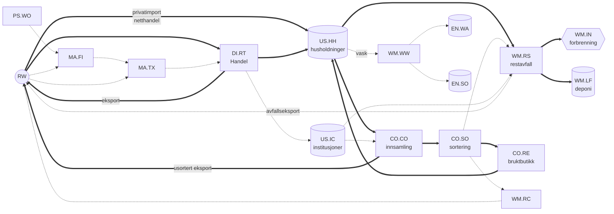

# Systemdefinisjon – Tekstil-MFA for Norge

*Levende dokument. Maskinlesbar kilde: [system/processes.csv](../system/processes.csv) og [system/flows.csv](../system/flows.csv). Endres systemet, oppdateres CSV-filene først, og så denne teksten.*

## Avgrensning

| Dimensjon | Valg (forslag) | Status |
|---|---|---|
| Geografi | Norge (fastlandet). Import og eksport går via poolen RW. | forslag |
| Tid | Data 1988–2024 (SSB 08801 starter i 1988). Rapportering 1990–2024, slik at lagermodellen får innsvingingsår. | beslutning D2 |
| Produkter | Kjerne: klær (CL), hjemmetekstiler (HT) og sko (FW). Dette er samme avgrensning som NORSUS (2023) og EUs produsentansvar for tekstiler. Tekniske tekstiler, tepper og andre konfeksjonerte varer (OT) spores i handelsdata, men holdes utenfor kjernen. | beslutning D1 |
| Enhet | kt produktmasse (nettovekt slik den er deklarert). Tekstilmasse beregnes med andeler for ikke-tekstile deler. | beslutning D4 |
| Materiallag | Fase 1–2: TOT (all masse). Fase 3: fibertyper (PES, PA, PAC, EL, CO, WO, CV, OTH) via sammensetningsmatrise. | beslutning D4 |

## Navnekonvensjon (arvet fra NitrogenBudsjett)

`KILDE.SUB-MÅL.SUB-Navn-Lag`, for eksempel `RW.RW-DI.RT-Finished textile products import-TOT`.

* Pool = to bokstaver, subpool = to bokstaver.
* Laget er materialet. I N-budsjettet var dette N-forbindelsen (Nmix, NH3, …). Her er det TOT eller en fibertype.
* **Nytt i forhold til N-budsjettet:** Resultatradene har en ekstra kolonne, `product` (CL/HT/FW/…). Produktgruppe er altså en dimensjon og ikke en del av flytnavnet. Uten dette måtte hver flyt dupliseres tre ganger (beslutning D5).

## Pools og subpools

| Pool | Subpool | Type | Lager? | Innhold |
|---|---|---|---|---|
| **RW** Rest of the world | RW.RW | systemgrense | – | Import og eksport |
| **PS** Primary production | PS.WO | systemgrense | – | Norsk råull |
| **MA** Manufacturing | MA.FI | prosess | – | Ullvaskeri, spinneri |
| | MA.TX | prosess | – | Veving, strikking, konfeksjon, sko |
| **DI** Distribution | DI.RT | prosess | – | Engros, butikk og netthandel |
| **US** Use | US.HH | prosess | **ja** | Husholdninger, inkludert «dvalende» lager (klær som ikke brukes) |
| | US.IC | prosess | **ja** | Arbeidsklær, uniformer og institusjonstekstiler |
| **CO** Collection and sorting | CO.CO | prosess | – | Separat innsamling |
| | CO.SO | prosess | – | Sortering i Norge |
| | CO.RE | prosess | – | Bruktbutikker |
| **WM** Waste management | WM.RS | prosess | – | Restavfall, grovavfall og blandet næringsavfall |
| | WM.IN | sluk | – | Forbrenning med energiutnyttelse |
| | WM.LF | prosess | **ja** | Deponi (viktig før 2009) |
| | WM.RC | prosess | – | Materialgjenvinning |
| | WM.WW | prosess | – | Avløpsrensing (fibre fra vask) |
| **EN** Environment | EN.WA / EN.SO | prosess | **ja** | Fibre i vann og jord |
| | EN.AI | sluk | – | Fibre til luft og støv |

## Systemdiagram (kjerneflyter P1 med tykk strek)

Den fullstendige flytlisten med prioritet, metode og kandidatdata ligger i [system/flows.csv](../system/flows.csv). Den har 40 flyter: 13 med prioritet 1, 16 med prioritet 2 og 11 med prioritet 3. Flytnavn kan ikke inneholde bindestrek, fordi `-` skiller feltene i koden (sjekkes av `tests/test_system_register.py`).

## Metode per flyt (kolonnen `method`)

* **data**: Flyten er målt direkte (for eksempel handelsstatistikk).
* **parameter**: Flyten er en annen flyt eller et lager multiplisert med en overføringskoeffisient eller rate.
* **stock_model**: Flyten er utstrømmen fra lagermodellen (innstrøm og levetid).
* **balance**: Flyten er restleddet i massebalansen til en prosess. Hver prosess har høyst én balanseflyt. Blir den negativ i en MC-iterasjon, er det et signal om at dataene er inkonsistente. Da skal modellen feile tydelig, ikke klippe verdien til 0 i det stille.

## Åpne beslutninger

| ID | Spørsmål | Anbefaling |
|---|---|---|
| D1 | Produktavgrensning | CL+HT+FW som kjerne. Beregn FW separat, slik at resultatene kan vises med og uten sko. OT er utenfor. |
| D2 | Tidsperiode og startlager | Rapporter 1990–2024. Innstrøm før 1988 settes til 1988-nivået (alternativt en trend), og startlageret testes i en følsomhetsanalyse. |
| D3 | Hvor detaljert skal MA være? | Enkel balanse (P2). Norsk tekstilindustri er liten, men ull er en norsk særegenhet. |
| D4 | Masse og lag | Produktmasse er primær. Tekstilmasse beregnes via `nontextile_share_*`. Fiberlaget kommer i fase 3. |
| D5 | Produktdimensjon | Kolonnen `product` i resultatene (er implementert). |
| D6 | Eksport: gjeneksport eller norsk produksjon? | All eksport av ferdigvarer føres fra DI.RT inntil videre. Splitt eventuelt med industristatistikk. |
| D7 | Privatimport og direkte netthandel | Grensehandelsstatistikk og husholdningsundersøkelser omregnes til kg via enhetsverdier (NOK/kg) fra 08801. Stor usikkerhet. |
| D8 | Massebalansestrategi | Lagermodellen gir kasseringer (top-down). Avfallsstatistikk og plukkanalyser brukes som *uavhengig kontroll* (bottom-up). Senere kan dette kalibreres, eventuelt bayesiansk. |
| D9 | Uformell ombruk (Finn, Tise, arv) | Regnes som lengre levetid i US.HH, ikke som egen flyt. |
| D10 | Dvalende lager | Ligger inne i US.HH. Levetiden måles fra kjøp til kassering. |
| D11 | Forbrenning | WM.IN er et sluk. Forbrenning i utlandet er en flyt til RW. |
| D12 | Framtidsscenarier (produsentansvar, 2030+) | Utenfor omfanget til den historiske modellen er ferdig. Arkitekturen skal likevel tillate det. |
