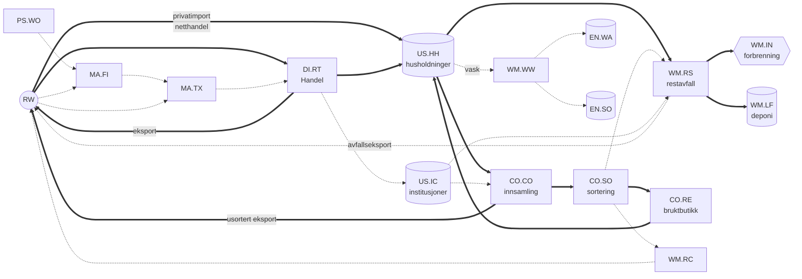

# Systemdefinisjon – Tekstil-MFA for Norge

*Levende dokument. Maskinlesbar kilde: [system/processes.csv](../system/processes.csv) og [system/flows.csv](../system/flows.csv). Endres systemet, oppdateres CSV-filene først, og så denne teksten.*

## Avgrensning

| Dimensjon | Valg (forslag) | Status |
|---|---|---|
| Geografi | Norge (fastlandet). Import og eksport går via poolen RW. | forslag |
| Tid | Data 1988–2025 (SSB 08801 starter i 1988). Rapportering fra 1990 til siste år med handelsdata (nå 2025), slik at lagermodellen får innsvingingsår. | besluttet D2 |
| Produkter | Klær (CL), hjemmetekstiler (HT), sko (FW) og andre tekstilvarer (OT). OT er delt i tepper (CA, HS 57), sekker og storsekker (SA, 6305), presenninger og telt (TA, 6306) og andre konfeksjonerte varer (OM, 6307–6308), fordi brukerne og levetidene er svært ulike. CL+HT+FW tilsvarer avgrensningen til NORSUS (2023) og EUs produsentansvar, og kan alltid rapporteres separat (`CORE_PRODUCTS` i `calculations/utils.py`). Tekniske tekstiler i HS 56 og 59 er utenfor. | besluttet D1 |
| Enhet | kt produktmasse (nettovekt slik den er deklarert). Tekstilmasse beregnes med andeler for ikke-tekstile deler. | besluttet D4 |
| Materiallag | Fase 1–2: TOT (all masse). Fase 3: fibertyper (PES, PA, PAC, EL, PP, CO, WO, CV, OTH) via sammensetningsmatrise. | besluttet D4 |

## Navnekonvensjon (arvet fra NitrogenBudsjett)

`KILDE.SUB-MÅL.SUB-Navn-Lag`, for eksempel `RW.RW-DI.RT-Finished textile products import-TOT`.

* Pool = to bokstaver, subpool = to bokstaver.
* Laget er materialet. I N-budsjettet var dette N-forbindelsen (Nmix, NH3, …). Her er det TOT eller en fibertype.
* **Nytt i forhold til N-budsjettet:** Resultatradene har en ekstra kolonne, `product` (CL, HT, FW, CA, SA, TA, OM). Produktgruppe er altså en dimensjon og ikke en del av flytnavnet. Uten dette måtte hver flyt dupliseres per produktgruppe (beslutning D5).

## Pools og subpools

| Pool | Subpool | Type | Lager? | Innhold |
|---|---|---|---|---|
| **RW** Rest of the world | RW.RW | systemgrense | – | Import og eksport |
| **PS** Primary production | PS.WO | systemgrense | – | Norsk råull |
| **MA** Manufacturing | MA.FI | prosess | – | Ullvaskeri, spinneri |
| | MA.TX | prosess | – | Veving, strikking, konfeksjon, sko |
| **DI** Distribution | DI.RT | prosess | – | Engros, butikk og netthandel |
| **US** Use | US.HH | prosess | **ja** | Husholdninger, inkludert «dvalende» lager (klær som ikke brukes) |
| | US.IC | prosess | **ja** | Arbeidsklær, uniformer og institusjonstekstiler |
| **CO** Collection and sorting | CO.CO | prosess | – | Separat innsamling |
| | CO.SO | prosess | – | Sortering i Norge |
| | CO.RE | prosess | – | Bruktbutikker |
| **WM** Waste management | WM.RS | prosess | – | Restavfall, grovavfall og blandet næringsavfall |
| | WM.IN | sluk | – | Forbrenning med energiutnyttelse |
| | WM.LF | prosess | **ja** | Deponi (viktig før 2009) |
| | WM.RC | prosess | – | Materialgjenvinning |
| | WM.WW | prosess | – | Avløpsrensing (fibre fra vask) |
| **EN** Environment | EN.WA / EN.SO | prosess | **ja** | Fibre i vann og jord |
| | EN.AI | sluk | – | Fibre til luft og støv |

## Systemdiagram (kjerneflyter P1 med tykk strek)

Den fullstendige flytlisten med prioritet, metode og kandidatdata ligger i [system/flows.csv](../system/flows.csv). Den har 40 flyter: 13 med prioritet 1, 16 med prioritet 2 og 11 med prioritet 3. Flytnavn kan ikke inneholde bindestrek, fordi `-` skiller feltene i koden (sjekkes av `tests/test_system_register.py`).

## Metode per flyt (kolonnen `method`)

* **data**: Flyten er målt direkte (for eksempel handelsstatistikk).
* **parameter**: Flyten er en annen flyt eller et lager multiplisert med en overføringskoeffisient eller rate.
* **stock_model**: Flyten er utstrømmen fra lagermodellen (innstrøm og levetid). Brukes ikke for flyter der det finnes offisiell statistikk (D8). Lagermodellen gir da et parallelt anslag til sammenligning.
* **balance**: Flyten er restleddet i massebalansen til en prosess. Hver prosess har høyst én balanseflyt. Blir den negativ i en MC-iterasjon, er det et signal om at dataene er inkonsistente. Da skal modellen feile tydelig, ikke klippe verdien til 0 i det stille.

## Beslutninger

| ID | Spørsmål | Anbefaling |
|---|---|---|
| D1 | Produktavgrensning | **Besluttet 2026-09-29:** CL, HT, FW og OT, med OT delt i CA, SA, TA og OM. Alle produktgrupper beregnes separat. Ferdige tekniske varer i HS 56/59 (tau, nett, slanger) er utenfor. Sekker (SA) behandles som emballasje: de kasseres samme år, uten lager i bruk. |
| D13 | Sekker som emballasje | **Besluttet 2026-09-29:** SA går DI.RT → US.IC med levetiden `immediate` (ingen lager) → avfall samme år. Sekker telles med i tilført masse, men holdes utenfor sammenligninger med tekstilavfallsstatistikk, fordi de trolig registreres som plastemballasje der. |
| D14 | Næringslivets varelinjer under 1 000 kr (SSB 99.60.1000) | **Besluttet 2026-09-29:** Holdes utenfor hovedresultatet. Mulig underdekning av klesimport (ca. 7 kt, ≈ 13 % i 2024, svært usikkert) omtales som diskusjonspunkt. Parameter `lowvalue_undercoverage_CL` brukes bare i følsomhetsanalyse. |
| D15 | Kildekjede for tekstiler i restavfall og behandlingsmåte | **Besluttet 2026-09-29:** 1990–1998: SSBs avfallsregnskap for tekstiler (ankerår 1991 og 1998). 1995–2011: SSB 05281, brukt for fordelingen på behandlingsmåter (nivået brukes bare som sammenligning, fordi det kan være beregnet ut fra tilførsel og levetid). 2012–2017: interpolert. 2018, 2022, 2025: plukkanalyser (Mepex) via Watson 2020 og NORSUS 2023/2026. Se `claude_tekst/2026-09-29_datainventar_P1-flyter.md`. |
| D2 | Tidsperiode og startlager | **Besluttet 2026-09-29:** Rapporter fra 1990 til siste år med data (2024 da beslutningen ble tatt, 2025 fra oppdateringen samme dag). Innstrøm før 1988 settes til 1988-nivået (alternativt en trend), og startlageret testes i en følsomhetsanalyse. |
| D3 | Hvor detaljert skal MA være? | **Besluttet 2026-09-29:** Enkel balanse (P2). Norsk tekstilindustri er liten, men ull er en norsk særegenhet. |
| D4 | Masse og lag | **Besluttet 2026-09-29:** Produktmasse er primær. Tekstilmasse beregnes via `nontextile_share_*`. Fiberlaget kommer i fase 3. |
| D5 | Produktdimensjon | **Besluttet 2026-09-29:** Kolonnen `product` i resultatene (er implementert). |
| D6 | Eksport: gjeneksport eller norsk produksjon? | **Besluttet 2026-09-29:** All eksport av ferdigvarer føres fra DI.RT (6,6 kt i 2022, mot 148 kt import). Når MA er kvantifisert, flyttes en andel til MA.TX → RW, begrenset oppad av norsk produksjon. |
| D7 | Privatimport og direkte netthandel | **Besluttet 2026-09-29:** Kronebeløp fra grensehandelsstatistikk og forbruksundersøkelser regnes om til kg med NOK/kg per varegruppe fra 08801. Direkte netthandel får stor usikkerhet, og VOEC-året 2020 legges inn som et brudd i tidsserien. Første steg er å avklare hvordan lavverdiforsendelser føres i 08801 før og etter 2020. |
| D8 | Massebalansestrategi | **Besluttet 2026-09-29:** Offisiell avfallsstatistikk er hovedkilden for kasseringer (innsamling, restavfall, deponi og forbrenning). Lagerendringen i US.HH og US.IC blir restleddet: tilført minus kassert. Lagermodellen (innstrøm og levetid) kjøres parallelt og brukes til sammenligning og diskusjon, ikke til å fylle hull. Hull i avfallsdataene interpoleres mellom offisielle ankerpunkter. |
| D9 | Uformell ombruk (Finn, Tise, arv) | **Besluttet 2026-09-29:** Regnes som lengre levetid i US.HH, ikke som egen flyt. Det påvirker bare den parallelle lagermodellen, fordi hovedresultatet har lagerendringen som restledd (D8). |
| D10 | Dvalende lager | **Besluttet 2026-09-29:** Ligger inne i US.HH. Levetiden måles fra kjøp til kassering, inkludert lagringstid. Andelen som ikke brukes kan eventuelt skilles ut som diskusjonspunkt hvis garderobestudiene oppgir den. |
| D11 | Forbrenning | **Besluttet 2026-09-29:** WM.IN er et sluk (aske og utslipp følges ikke). Forbrenning i utlandet er en flyt til RW, beregnet som eksportert restavfall × tekstilandel fra plukkanalyser. |
| D12 | Framtidsscenarier (produsentansvar, 2030+) | **Besluttet 2026-09-29:** Utenfor omfanget til den historiske modellen er ferdig. Arkitekturen skal likevel tillate det. |
