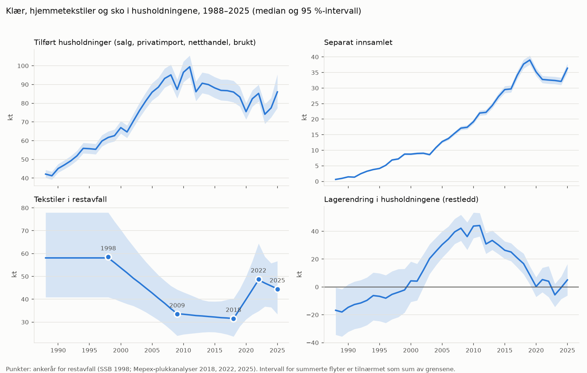

# Tekstil-MFA for Norge

**Sist generert:** 2026-10-05

{: .label .label-red }
Under arbeid

> Modellen, dataene og resultatene er under utvikling og ikke validert. Ikke bruk tallene til forskning eller beslutninger ennå.

Dynamisk, probabilistisk MFA (Monte Carlo, flodym) for klær, hjemmetekstiler, sko og andre tekstilvarer i Norge, 1988–2025. Hver flyt har en egen side med tidsserie, usikkerhet, fibersammensetning og dokumentasjon fra koden. Systemdefinisjon, metode og plan står i [SYSTEMDEFINISJON](https://github.com/aroyne/TekstilMFA/blob/main/docs/SYSTEMDEFINISJON.md), [METODE](https://github.com/aroyne/TekstilMFA/blob/main/docs/METODE.md) og [PLAN](https://github.com/aroyne/TekstilMFA/blob/main/docs/PLAN.md).

## Pools

* [1. Rest of the world (RW)](rest_of_the_world_pool/pool_rest_of_the_world.html)
* [2. Primary production (PS)](primary_production_pool/pool_primary_production.html)
* [3. Manufacturing (MA)](manufacturing_pool/pool_manufacturing.html)
* [4. Distribution (DI)](distribution_pool/pool_distribution.html)
* [5. Use (US)](use_pool/pool_use.html)
* [6. Collection and sorting (CO)](collection_and_sorting_pool/pool_collection_and_sorting.html)
* [7. Waste management (WM)](waste_management_pool/pool_waste_management.html)
* [8. Environment (EN)](environment_pool/pool_environment.html)

## Kjerneflyter i husholdningene

## Statistikk mot parallell lagermodell

<!-- MANUAL:INDEX_TEXT:START -->

<!-- MANUAL:INDEX_TEXT:END -->
