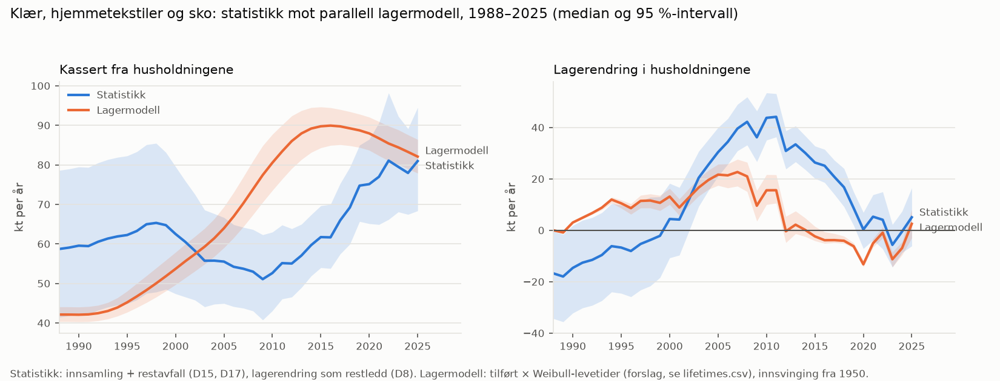

# Households (US.HH)

Textiles in use or stored (hibernating) in private households; the main in-use stock

Type: process. Lager: yes.

## Flyter ut

* [Separate collection from households](../use_pool/flow_us_hh_co_co_separate_collection_from_households.html) → CO.CO
* [Reusable textiles in residual and bulky waste](../use_pool/flow_us_hh_wm_rs_reusable_textiles_in_residual_and_bulky_waste.html) → WM.RS
* [Worn textiles in residual and bulky waste](../use_pool/flow_us_hh_wm_rs_worn_textiles_in_residual_and_bulky_waste.html) → WM.RS
* [Fibre release in laundry](../use_pool/flow_us_hh_wm_ww_fibre_release_in_laundry.html) → WM.WW *(planlagt)*
* [Fibre release to air and dust](../use_pool/flow_us_hh_en_ai_fibre_release_to_air_and_dust.html) → EN.AI *(planlagt)*

## Flyter inn

* [Private imports](../rest_of_the_world_pool/flow_rw_rw_us_hh_private_imports.html) ← RW.RW
* [Direct online imports](../rest_of_the_world_pool/flow_rw_rw_us_hh_direct_online_imports.html) ← RW.RW
* [Sales to households](../distribution_pool/flow_di_rt_us_hh_sales_to_households.html) ← DI.RT
* [Secondhand sales to households](../collection_and_sorting_pool/flow_co_re_us_hh_secondhand_sales_to_households.html) ← CO.RE

## Massebalanse

<iframe src="../output_files/plots/pages/balance_us_hh.html" width="100%" height="500px" frameborder="0" scrolling="no"></iframe>

## Lager og parallell lagermodell (D8)

<iframe src="../output_files/plots/pages/stock_us_hh.html" width="100%" height="420px" frameborder="0" scrolling="no"></iframe>

Se også [notatet om lagermodellen mot statistikken](https://github.com/aroyne/TekstilMFA/blob/main/claude_tekst/2026-10-05_lagermodell_mot_statistikk.md).

## Merknader

<!-- MANUAL:POOL_TEXT:START -->
*Ingen manuelle merknader ennå.*
<!-- MANUAL:POOL_TEXT:END -->
